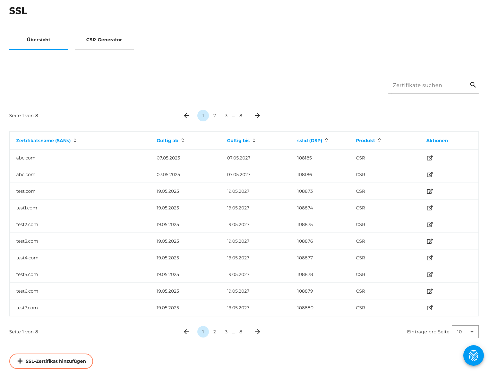
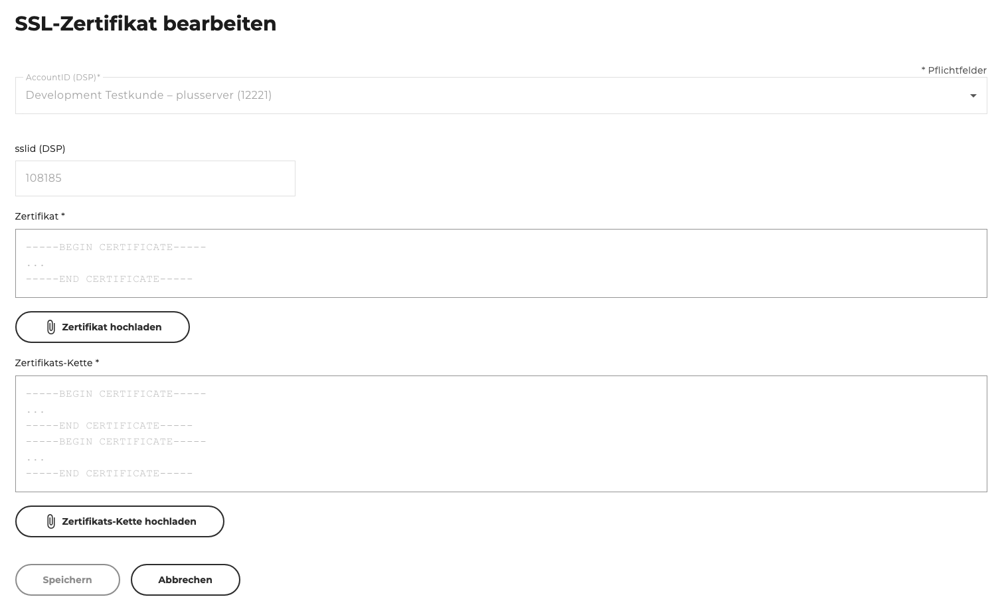
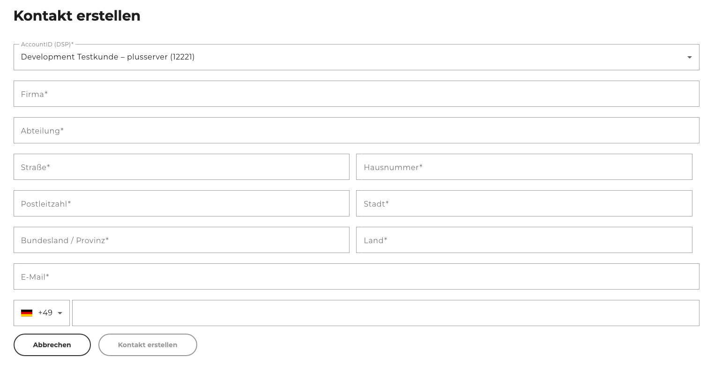

Auf der Seite **„SSL“** können Sie Ihre bestehenden SSL-Zertifikate verwalten, neue Zertifikate hinzufügen oder Zertifikatsignierungsanforderungen (CSRs) generieren. Die Seite ist in zwei Tabs unterteilt: **Übersicht** und **CSR-Generator**.

### Übersicht

Im Tab **„Übersicht“** sehen Sie eine tabellarische Darstellung aller SSL-Zertifikate und CSRs, die in Ihrem Kundenaccount hinterlegt sind.\

#### Funktionen

- **Suchfunktion:**
  Mithilfe der Suchleiste können Sie gezielt nach SSl-Zertifikaten oder CRSs suchen (z. B. durch Suche nach der Domain).

- **SSL-Zertifikat hinzufügen:**
  Über den Button „SSL-Zertifikat hinzufügen“ gelangen Sie zu einer separaten Seite, auf der Sie ein vorhandenes SSL-Zertifikat sicher im CloudHub hochladen können.

- **SSL-Zertifikat bearbeiten:**
  Über den Button „Bearbeiten“ in der jeweiligen Tabellenzeile können Sie ein bestehendes Zertifikat aktualisieren. Sie gelangen zur Seite **„SSL-Zertifikat bearbeiten“**.

### SSL-Zertifikat hinzufügen

Auf dieser Seite können Sie ein vorhandenes SSL-Zertifikat sicher im CloudHub hochladen.

#### Formularfelder

- **AccountID:** Auswahl des Accounts, dem das Zertifikat zugewiesen werden soll
- **Zertifikat:** Eingabe des SSL-Zertifikats
- **Schlüssel:** Eingabe des zugehörigen privaten Schlüssels
- **Zertifikats-Kette:** Eingabe der vollständigen Zertifikatskette

### SSL-Zertifikat bearbeiten

Wenn Sie ein bestehendes SSL-Zertifikat über die Übersicht bearbeiten, gelangen Sie auf die Seite **„SSL-Zertifikat bearbeiten“**.\

### Bearbeitbare Felder

- **Zertifikat:** Ersetzen Sie das hinterlegte Zertifikat
- **Zertifikatskette:** Aktualisieren Sie die zugehörige Zertifikatskette

Für beide Felder gibt es auch die Möglichkeit eines Uploads.

### CSR-Generator

Im Tab **„CSR-Generator“** können Sie eine Zertifikatsignierungsanforderung (CSR) erzeugen, um ein neues SSL-Zertifikat bei einer Zertifizierungsstelle zu beantragen.\

#### Felder zur Erstellung einer CSR

- **Account auswählen:**
   Wählen Sie den Kundenaccount, für den die CSR erstellt werden soll.

- **Kontakt auswählen:**
   Wählen Sie einen bestehenden Kontakt, der mit dem Kundenaccount verknüpft ist.
   Falls kein passender Kontakt vorhanden ist, können Sie über den Button „Kontakt hinzufügen“ einen [neuen Kontakt anlegen](#kontakt-hinzufügen).

- **Schlüsselparameter festlegen:**
  - **Schlüsseltyp:** Auswahl zwischen `ECC` oder `RSA`
  - **Schlüsselgröße:**
    - Für ECC: 256, 384, 521
    - Für RSA: 2048, 4096, 8192

- **Subject Alternate Name (SAN):**
  - Geben Sie den SAN in ASCII-Form ein (Pflichtfeld)
  - Für **Multi-Domain-Zertifikate** geben Sie die Domains als kommagetrennte Liste ein (z. B. `example.com,www.example.com,shop.example.com`)

Nach dem Erstellen wird der CSR ihnen in der **Übersicht** angezeigt. Außerdem geben wir Ihnen eine Anleitung, wie Sie mit verschiedenen Tools einen privaten Schlüssel aus dem CSR erstellen können.

### Kontakt hinzufügen

Wenn Sie im CSR-Generator auf „Kontakt hinzufügen“ klicken, gelangen Sie zu einem Formular zur Erstellung eines neuen Kontakts.\

#### Erforderliche Angaben

- **Kundenaccount:** Auswahl des Accounts, dem der Kontakt zugewiesen wird
- **Firma:** Name der Organisation
- **Abteilung:** z. B. IT, Technik, Sicherheit
- **Adresse:** vollständige Anschrift (Straße, PLZ, Ort, Land)
- **E-Mail-Adresse:** zur Kommunikation und Validierung
- **Telefonnummer (optional):** zur Rücksprache oder Verifikation

Nach dem Speichern steht der neue Kontakt im CSR-Generator zur Auswahl bereit.
